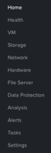

.. _lab_nutanix_technology_overview:

---------------------------------
Lab - Nutanix Tech Overview
---------------------------------

Overview
++++++++

This lab will introduce the Prism Element UI, and familiarize you with its layout and navigation.

Prism Element
+++++++++++++

From the Firefox web browser (preferred), log into the Nutanix Prism GUI using the Cluster IP.

Open https://<*NUTANIX-CLUSTER-IP*>:9440

Fill out the following fields and click **Enter**:

- **Username** - admin
- **Password** - *HPOC Password*

.. figure:: images/nutanix_tech_overview_01.png

After you log in to Prism Element, familiarize yourself with the Prism UI. Explore the information on the **Home** screen, as well as the other screens.

Review the Home screen, and identify the following items:

- Hypervisor
- Version
- Hardware Model
- Health
- VM Summary
- Warning Alerts
- Data Resiliency Status

.. figure:: images/nutanix_tech_overview_02.png

Review the UI navigation options.

Examine the cluster hardware by using the navigation menu, and go to the Hardware.

In **Prism > Hardware**, click **Hardware**, then click **Diagram**.

Review the hardware summary information:

- Blocks
- Hosts
- Memory
- CPU
- Disks

.. figure:: images/nutanix_tech_overview_04.png

Review the other sections, and do a quick walk through:

- VM
- Health
- Network
- Data Protection
- Storage
- Alerts
- Etc.

Review other sections of the Prism UI

- Health :fa:`heartbeat`
- Alarms :fa:`bell`
- Tasks :fa:`circle-o`
- Search :fa:`search`
- Help :fa:`question`
- Configuration :fa:`cog`
- User :fa:`user`

.. figure:: images/nutanix_tech_overview_05.png

.......................
Prism Element UI Review
.......................

Where would you locate the version of AOS you are running?

.. figure:: images/nutanix_tech_overview_06.png

You can do this by clicking on the **User** drop down :fa:`user`, and clicking **About Nutanix**.

How would you get to the following screen to view a summary of the number of hosts (or nodes) and the resource capacity and current utilization?

.. figure:: images/nutanix_tech_overview_07.png

In **Prism > Hardware**, click **Hardware**, then click **Table**.

How would you get the following screen to see the health of your cluster?

.. figure:: images/nutanix_tech_overview_08.png

In **Prism > Health**, click **Health**, then click **Summary** in the right pane.

What page would show you the latest activity in the system? On this page, you can monitor the progress of any task and keep track of what has been done in the past using time stamps. Can you figure out two different ways to get there?

.. figure:: images/nutanix_tech_overview_09.png

First Way, In **Prism > Tasks**, click **Tasks**. Second Way, click :fa:`circle-o`.

.. note::

  In ESXi:

  - The containers created in Prism appear as datastores in vCenter.

  Example view of storage containers from Prism:

  .. figure:: images/nutanix_tech_overview_13.png

  Example view of storage containers (datastores) from vCenter:

  .. figure:: images/nutanix_tech_overview_14.png

Takeaways
+++++++++

- Prism is thoughtfully laid out UI
- Critical information is displayed front and center
