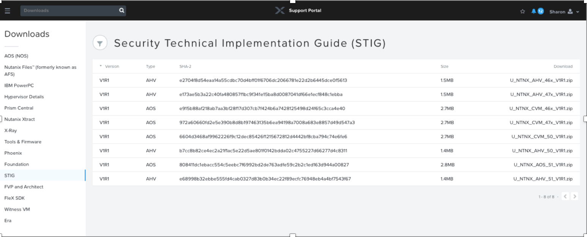

.. _lab_stig:

-------------
Lab - STIGs
-------------

Overview
++++++++

At Nutanix, security is a first-class citizen that drives best practices providing both defense in depth and a hardened by default posture for releases. In efforts to stay agile and effective when fighting the ever-increasing cyber security threads, Nutanix’s Security Development Life Cycle addresses security at every step of the development process instead of applying it at the end as an afterthought. This includes automated security testing during development and threat modeling to assess and mitigate customer risk from code changes. Nutanix also provides administrators with Security Technical Implementation Guides (STIGs), which are security tools encoded in a machine-readable format to facilitate automated validation, ongoing monitoring, and self-remediation. These reduce the time required to verify security compliance from weeks or months to days without slowing down product evolution. STIGs are based on well-established standards by National Institute of Standards and Technology (NIST) that can apply to multiple baseline requirements for DoD and PCI-DSS. However, Nutanix STIGs are specific to the Acropolis platform and therefore more effective.

In this lab you will see STIGs in action in order to see first-hand how they harden the Nutanix Enterprise Cloud OS and help reduce zero-day vulnerabilities. We will briefly touch upon the following three areas.

•	Downloading the STIGs
•	Manually Running a STIG Report on a Nutanix Controller VMs
•	Analyzing the STIG Report
•	Manually compromising the environment and Implementing Fixes

Downloading STIGs
+++++++++++++++++

STIGs can be downloaded from the Nutanix Portal page as shown in the image below.

A Nutanix Portal account is needed to access these, but a sample guide can be found at the following link.

STIG Examples
+++++++++++++

When you open the PDF inventory of all the of the STIGs, you can see upwards of 700 STIGs, two of which are shown below as an example below:

AOS STIG Examples
.................

- **Group ID (Vulid)**: NTNX-51-000034
- **Group Title**: SRG-OS-000364-GPOS-00151
- **Rule ID**: NTNX-51-000034_rule
- **Severity**: CAT II
- **Rule Version (STIG-ID)**: NTNX-51-000034
- **Rule Title**: The /etc/shadow file must be group-owned by root.
- **Vulnerability Discussion**: Failure to provide logical access restrictions associated with changes to system configuration may have significant effects on the overall security of the system. When dealing with access restrictions pertaining to change control, it should be noted that any changes to the hardware, software, and/or firmware components of the operating system can have significant effects on the overall security of the system. Accordingly, only qualified and authorized individuals should be allowed to obtain access to operating system components for the purposes of initiating changes, including upgrades and modifications. Logical access restrictions include, for example, controls that restrict access to workflow automation, media libraries, abstract layers (e.g., changes implemented into third-party interfaces rather than directly into information systems), and change windows (e.g., changes occur only during specified times, making unauthorized changes easy to discover). The /etc/shadow file must be group-owned by root. Verify the operating system enforces access restrictions. If it does not, this is a finding.
- **IAControls**: CM-5 (1)
- **Check Content**: salt-call state.sls security/CVM/fdpermsownerCVM
- **Fix Text**: salt-call state.sls security/CVM/fdpermsownerCVM
- **CCI**: CCI-001813

- **Group ID (Vulid)**: NTNX-51-000210
- **Group Title**: SRG-OS-000096-GPOS-00050
- **Rule ID**: NTNX-51-000210_rule
- **Severity**: CAT I
- **Rule Version (STIG-ID)**: NTNX-51-000210
- **Rule Title**: The operating system must have telnet-server uninstalled.
- **Vulnerability Discussion**: In order to prevent unauthorized connection of devices, unauthorized transfer of information, or unauthorized tunneling (i.e., embedding of data types within data types), organizations must disable or restrict unused or unnecessary physical and logical ports/protocols on information systems. Operating systems are capable of providing a wide variety of functions and services. Some of the functions and services provided by default may not be necessary to support essential organizational operations. Additionally, it is sometimes convenient to provide multiple services from a single component (e.g., VPN and IPS); however, doing so increases risk over limiting the services provided by any one component. To support the requirements and principles of least functionality, the operating system must support the organizational requirements, providing only essential capabilities and limiting the use of ports, protocols, and/or services to only those required, authorized, and approved to conduct official business or to address authorized quality of life issues. The telnet-server package must not be installed. Verify the operating system is configured to prohibit or restrict the use of functions, ports, protocols, and/or services, as defined in the PPSM CAL and vulnerability assessments. If it does not, this is a finding.
- **IAControls**: CM-7 b
- **Check Content**: salt-call state.sls security/CVM/packagesCVM
- **Fix Text**: salt-call state.sls security/CVM/packagesCVM CCI: CCI-000382

AHV STIG Example
................

- **Group ID (Vulid)**: NTNX-AHV-50-000623
- **Group Title**: SRG-OS-000364-GPOS-00151
- **Rule ID**: NTNX-AHV-50-000623_rule
- **Severity**: CAT II
- **Rule Version (STIG-ID)**: NTNX-AHV-50-000623
- **Rule Title**: Cron and crontab directories must have permissions set to 0700.
- **Vulnerability Discussion**: Failure to provide logical access restrictions associated with changes to system configuration may have significant effects on the overall security of the system. When dealing with access restrictions pertaining to change control, it should be noted that any changes to the hardware, software, and/or firmware components of the operating system can have significant effects on the overall security of the system. Accordingly, only qualified and authorized individuals should be allowed to obtain access to operating system components for the purposes of initiating changes, including upgrades and modifications. Logical access restrictions include, for example, controls that restrict access to workflow automation, media libraries, abstract layers (e.g., changes implemented into third-party interfaces rather than directly into information systems), and change windows (e.g., changes occur only during specified times, making unauthorized changes easy to discover). Cron and crontab directories must have mode 0700. Verify the operating system enforces access restrictions. If it does not, this is a finding.
- **IAControls**: CM-5 (1)
- **Check Content**: salt-call state.sls security/KVM/cronKVM
- **Fix Text**: salt-call state.sls security/KVM/cronKVM
- **CCI**: CCI-001813

Running a STIG Report on Nutanix Controller VMs
+++++++++++++++++++++++++++++++++++++++++++++++

You can run a STIG report, which will check on all the STIGs and report on which are compliant in your system or not.

The steps to run the STIG report are as follows:

Connect to Controller VM (CVM) via SSH (Using Terminal, putty, or similar program)

Elevate your privileges to root to execute the report (you won’t have to enter a password)

.. code-block:: bash

  sudo su root

Change to the root directory of the CVM

.. code-block:: bash

  cd /root

Within the /root directory, list the files available to the root user to execute

.. code-block:: bash

  ls -l

You should see a similar output:

.. code-block:: bash

  root@NTNX-14SX35100046-A-CVM:10.21.71.29:~# ls -l
  total 248
  -rw-------. 1 root root   3314 Sep 11  2017 anaconda-ks.cfg
  drwxr-x---. 2 root root   4096 Dec 13 23:04 filesystems
  -rw-r-----. 1 root root   1132 May  3  2018 homeaudit.pp
  -rw-r-----. 1 root root   1231 May  3  2018 my-runcon.pp
  -rw-r-----. 1 root root    464 May  3  2018 my-runcon.te
  -rw-------. 1 root root   3222 Sep 11  2017 original-ks.cfg
  -rwxr-x---. 1 root root  10034 May  3  2018 report_open_jre8_stig.sh
  -rwx------. 1 root root 132760 Aug 30 23:50 report_stig.sh
  -rwxr-x---. 1 root root  72376 May  3  2018 report_web_stig.sh
  drwxr-x---. 2 root root   4096 Dec 13 23:17 sretools
  -rw-r-----. 1 root root    840 May  3  2018 sshdlocal.pp

There should be three .sh files that end in _stig.sh and you’ll want to run the one that outputs the report in the format you prefer.

In this example, we’ll run the generic text output “report_stig.sh”

.. code-block:: bash

  ./report_stig.sh

The output will go into the root user log folder.

To get the file, you’ll need to change to that folder and change the permissions on the report we just created.

.. code-block:: bash

  cd /home/log

List the files in the folder and note the name of the report.

.. code-block:: bash

  ls -l | grep STIG

Change the permissions on the report we ran earlier, substituting the actual file name for the asterisks.

.. code-block:: bash

  chmod 777 STIG-report-**-**-****-**-**-**

Copy the report to the nutanix home directory, substituting the actual file name for the asterisks.

.. code-block:: bash

  cp STIG-report-**-**-****-**-**-** /home/Nutanix

Change the owner of the report file to be the Nutanix user

.. code-block:: bash

  chown nutanix:nutanix /home/Nutanix/STIG-report-**-**-****-**-**-**

Use a secure copy tool (SCP, WINSCP, PSCP, etc) to copy the report results file to your workstation from the CVM.

Be sure to login to the CVM using the **nutanix** username and browse to its home directory to find the file we created above.

Analyzing the STIG Report
+++++++++++++++++++++++++

Obtain the STIG report generated in the previous step and use it to gather the current compliance state of the system.

STIG status (check) report for the Nutanix Operating Platform, NTNX.

You can leverage this report for validation and accreditation requirements for security compliance.

This will report the results of all elements that make up the NTNX STIG, and the report will show the compliance result for each of the checks inside the STIG.

  - The first sentence says the actual check name
  - The second sentence is an explanation of the check
  - The third sentence is the legend for the result of the check
  - The fourth sentence is the actual result of the check
  - The fifth sentence is the completion status of the check

Examples results shown in the two checks below:

Example of a finding:

.. code-block:: bash

  CAT I RHEL-07-021710 SRG-OS-000095-GPOS-00049 CCI-000381 CM-7 a, CM-7 b
  The telnet-server package must not be installed.
  The result of the check should be yes.  If no, then it's a finding
  no
  Completed.

Example of a non-finding:

.. code-block:: bash

  CAT II RHEL-07-021030 SRG-OS-000480-GPOS-00227 CCI-000366 CM-5 (1)
  All world-writable directories must be group-owned by root, sys, bin, or an application group.
  The result of the check should be yes.  If no, then it's a finding
  yes
  Completed.

Manually Compromising the Environment and Implementing Fixes
++++++++++++++++++++++++++++++++++++++++++++++++++++++++++++

In this section we are going to pretend to be the ‘bad guy’ and compromise the system by making non-compliant changes to the system as suggested below and fixing using STIGs.

.. note::

  By default, the calls executed here are scheduled to run daily as part of a cron job that runs them automatically.

Compromise the /etc/shadow file
...............................

The following text was extracted from one of the security checks under the AOS STIGs:

- **Rule Version (STIG-ID)**: NTNX-51-000034
- **Rule Title**: The /etc/shadow file must be group-owned by root.
- **Fix Text**: salt-call state.sls security/CVM/fdpermsownerCVM

Let’s elevate privileges to root to change the group ownership permissions of the /etc/shadow with the following commands:

Elevate privileges:

.. code-block:: bash

  sudo su root

Verify the current ownership:

.. code-block:: bash

  ls -l /etc/shadow
  ----------. 1 root root 943 Dec 18 15:37 /etc/shadow

Change the group ownership:

.. code-block:: bash

  chown root:nutanix /etc/shadow
  ls -l /etc/shadow
  ----------. 1 root nutanix 943 Dec 18 15:37 /etc/shadow

Manually run the salt call to fix this vulnerability:

.. code-block:: bash

  salt-call state.sls security/CVM/fdpermsownerCVM

Verify the fix has taken place:

.. code-block:: bash

  ls -l /etc/shadow

Compromise a world-writable directory /tmp
..........................................

From the report you generated in a previous section, download it or access it from the console in order to get the state of the following check:

All world-writable directories must be group-owned by root, sys, bin, or an application group.
The result of the check should be yes.  If no, then it's a finding
yes
Completed.

You can search for this specific report from the CVM console where the report was run and using the following command:

.. code-block:: bash

  grep -A 4 -B 1 "All world-writable directories " /home/log/STIG-report-**-**-****-**-**-**
Where the stars are to be substituted by your report’s id.

It should say yes by default.

Let’s compromise the system so that this check says “no” and then manually fix the issue.

Elevate privileges:

.. code-block:: bash

  sudo su root

Verify the current ownership:

.. code-block:: bash

  ls -l / |grep  tmp
  drwxrwxrwt.  14 root root  1024 Dec 21 02:59 tmp

Change the group ownership:

.. code-block:: bash

  chown root:nutanix /tmp

Verify the ownership change:

.. code-block:: bash

  ls -l / | grep tmp
  drwxrwxrwt.  14 root nutanix  1024 Dec 21 03:16 tmp

After we have achieved this, let’s re-run the report to see if this change has been detected

.. code-block:: bash

  cd /root
  ./report_stig.sh
  grep -A 4 -B 1 "All world-writable directories " /home/log/STIG-report-**-**-****-**-**-**

You should see a “no” this time, indicating a finding.

Manually run the salt call to fix this vulnerability:

.. code-block:: bash

  salt-call state.sls security/CVM/fdpermsownerCVM

List the / directory again and note that the ‘compromise’ has been reverted back.

.. code-block:: bash

  ls -l / | grep tmp
  drwxrwxrwt.  14 root root  1024 Dec 21 03:42 tmp

Takeaways
+++++++++

- Nutanix uses STIGs to verify compliance.
- Nutanix uses daily checks to self-remediate issues.
